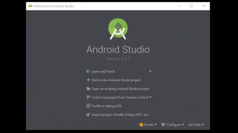
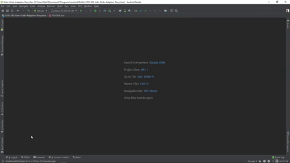
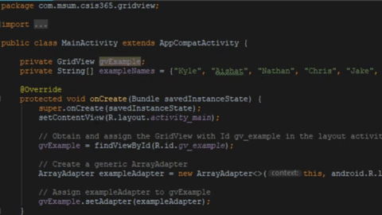

# CSIS 365 Model-View-ViewModel

## Getting Started

#### Clone the Project from GitHub
1. Open up Android Studio
2. Checkout the project from version control using Git
3. Enter the project url obtained from the clone button on GitHub
4. Test the connection to the URL
5. Clone the Repository
6. Open the project in a new window

## Common Shortcuts

#### Double Shift
- Searches everything and provides ways to filter the response

#### Control + Click or Control + B
- Go to Declaration (directly)

#### Control + [
- Navigate Back

#### Control + ]
- Navigate Forwards

#### Control + Shift + F
- Find in Path

#### Control + Shift + R
- Replace in Path

#### Control + D
- Duplicate Line or Selection